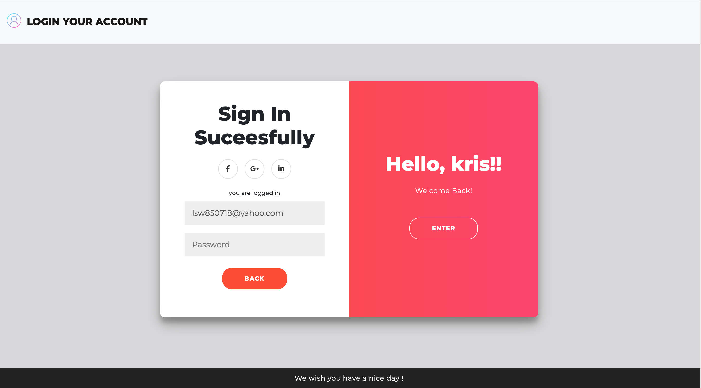

# Login design


A Login design web application for users that can use this website to log in the user interface demo
about the parties of front-end which refer to "Florin Pop" (https://codepen.io/FlorinPop17/pen/vPKWjd?editors=1000) 
## Features
- Users can create his/her account 
- Plus, Users can connect Todo-list web that is my another project after he/she log in by his/her email and password 


### Technology
- template engine -> Using template engine to covert files from html-like to html for browser
- router -> Using http GET POST etc.. to do route
- MONGODB -> Using mongoose  help app.js connect to database

### RESTful 
Compared to previous version, this version use the RESTful design pattern to reconstruction routes of app.js

## **install and running steps**

> After downldad or clone this URL of github
１.Use terminal in the project

```properties
cd 'file name'
```

２.install node modules

```properties
npm install
```

３.Set up MongoDB

```js
mongoose.connect('database_URI', { useNewUrlParser: true, useUnifiedTopology: true })
```
４.Run the project
> node
```properties
npm run start
```
> nodemon( if you need)
```properties
npm run dev
```

５.Browse the project on the browser

```
http://localhost:3000
```

If project is running , terminal will output
```
Listening on http://localhost:3000
```
If mongoDB is connecting , terminal will output 
```
mongodb connected
```
